# RADARSAT-2 change intelligence backend

## Goal and current evidence

Build a reproducible backend that turns comparable RADARSAT-2 acquisitions into a change raster, region polygons, quantified observations, and an API for the presentation dashboard. Human teammates own the frontend.

The opening slides require RADARSAT-2 Tropical Forests as a core source and a visual Value-Added Product. The presentation, including the demo, lasts five minutes. A reliable prepared result matters more than additional architecture.

The repository contains the slides, `.gitignore`, and the teammates' developing frontend. No local RADARSAT-2 product was found. Public EODMS STAC discovery works without authentication; product downloads declare bearer authentication. The collection is `Radarsat-2_Tropical_Forest_Products`. Catalog inspection found both older SGF and SLC products. Modern examples include XF0W2 SLC scenes larger than 5 GB. Catalog footprint CRS and sampled spacing do not establish a raster's projection or spatial resolution.

Source endpoints:

- [EODMS Tropical Forest collection](https://www.eodms-sgdot.nrcan-rncan.gc.ca/search/collections/Radarsat-2_Tropical_Forest_Products)
- [Official EODMS CLI](https://github.com/eodms-sgdot/eodms-cli), source revision `464b94920e7faf28c84a6d31229ef0b2828a1479`.
- [CSA data opportunity](https://www.asc-csa.gc.ca/eng/funding-programs/funding-opportunities/ao/2025-radarsat-2-tropical-forest-data-access-opportunity.asp).

## Architecture

Use an offline Python analysis pipeline and a small FastAPI service. The pipeline publishes a versioned result directory. The API reads that directory, validates it, and serves metadata, GeoJSON regions, and georeferenced image previews. The live demo uses prepared local results and requires neither EODMS nor processing at presentation time.

```mermaid
flowchart LR
  A[EODMS catalog and user-run download] --> B[Local product inventory]
  B --> C[Product-specific calibration and geocoding]
  C --> D[Alignment and quality checks]
  D --> E[Log-ratio and threshold]
  E --> F[Regions and measured area]
  F --> G[Versioned local result bundle]
  G --> H[Read-only API]
  H --> I[Teammates' interactive dashboard]
```

Storage: `data/raw/` for acquisitions, `data/reports/` for inspection and diagnostics, `data/processed/` for derived products. These are local and excluded from Git. Commit scripts, schemas, tests, assumptions, and catalog selection metadata; exclude credentials and bulk imagery.

## Scientific decisions and gates

1. Inspect delivered files before choosing preprocessing. Record product type, sample representation, calibration metadata, geolocation, acquisition geometry, and missing fields.
2. Select temporally separated acquisitions with matching polarization, beam/mode, orbit direction, and relative orbit where available, then check actual overlap and incidence differences.
3. Convert to comparable calibrated linear power. Complex samples require magnitude squared; detected amplitude and calibrated power need different handling. Determine that distinction from metadata and driver behavior.
4. Geocode/terrain-correct as the actual product requires. A common raster grid alone does not prove registration or terrain correction.
5. Measure registration on stable image structure. Record the diagnostic, threshold, residuals, and rejection decision. Inspect for coherent edge halos before interpreting change.
6. Compute `10 * log10(after / before)` on jointly valid positive power. Apply documented speckle filtering and nodata-aware handling. Choose the threshold from observed data and stable-reference diagnostics; record it rather than implying universal significance.
7. Extract connected regions, preserve holes, and calculate affected area in hectares using an appropriate projected/geodesic calculation. Report invalid and masked areas separately.
8. Rank candidates with `magnitude_db * sqrt(area_ha)`, in `dB sqrt(ha)`. This orders review work; it is not a probability. Evaluate any persistence or historical components only after sufficient data exists.

Two acquisitions support an observed difference and its observation interval. They do not establish persistence, exact event onset, or historical anomaly. Such metrics remain null with an explicit unavailable state. Use neutral explanations such as "anomalous radar change". Cause attribution needs supporting evidence.

Region dates use `baseline_at`, `detected_at`, and `observation_interval`. The detection date is the acquisition when a difference is observed, not the date its physical cause occurred. `magnitude_db` is the median absolute pixel change; `change_db` is the signed median. Their absolute values need not match. Area accounting reconciles the analysis footprint with jointly valid and unevaluable observations, and the retained region sum with total changed area.

SLC is already focused. Additional processing depends on the actual acquisition mode and delivered representation; range/azimuth compression or debursting is not a universal requirement. Driver calibration support must be checked for the delivered product. A calibration label in catalog metadata alone is insufficient evidence that a raster already contains calibrated linear power.

Water, terrain, moisture, seasonality, acquisition geometry, and registration remain potential explanations. Display processing and validation limitations. Do not report false-alarm rates without reference data that supports measuring them.

## Minimum result interface

Bundle version 1 contains `analysis.json`, `regions.geojson`, and before/after/change PNGs on the same WGS84 display bounds. `docs/API.md` will document exact endpoint and field definitions. Source scenes, processing steps, thresholds, registration evidence, valid area, candidate metrics, and null temporal fields travel with every result.

The API must distinguish absent results, invalid results, and ready results. Empty data cannot become a fabricated demonstration. Test fixtures remain in tests. Only declared, validated preview files can be served; the API cannot expose raw directories or start credential operations.

## Ordered work and ownership

1. Acquisition worker: reproducible official CLI setup and safe user-run credential prompt.
2. Catalog worker: comparable two/three-scene candidates and their real footprints.
3. Inventory worker: local product inspection and minimum preprocessing report.
4. API worker: validated result loading and endpoints for the frontend.
5. Scientific reviewer: independently challenge the method and readiness conditions.
6. Lead: shared configuration, contract consistency, reviews, and integration.
7. Once product bytes arrive: inspect them in parallel, select the minimum preprocessing route, and build the first real pair end to end.
8. Validate the pair and false-positive mechanisms. Add temporal/ranking features only after the real pair reaches the API.
9. Prepare a scientifically reviewed demonstration region and reproducibility commands. Coordinate dashboard integration with its human owners.

Workers use separate branches and file ownership. Review exact implementation commits before integration. Fetch current main before publishing and preserve teammates' changes. Keep persistent specialists when their context is useful; use independent reviewers for each implementation handoff.

## Highest risks

- Account access may not include the selected product bytes. Only the user performs credential actions.
- Large SLC scenes may make download and preprocessing too slow. Prefer a legitimate smaller comparable pair where possible and process a bounded overlap.
- Calibration/geolocation metadata may be insufficient for the chosen route.
- Geometric or radiometric differences may dominate the change result.
- A clear real candidate may not exist in the first pair. Select a demonstration region only after inspecting real output.
- Frontend and backend may diverge. Publish one field/endpoint contract early and keep changes coordinated.

## Acceptance

The backend milestone passes when two real acquisitions produce an inspected, aligned change result, GeoJSON regions with defensible area/magnitude and temporal context, and a runnable local API. Final project success additionally requires the teammates' interactive dashboard and a reliable prepared demo using these real outputs.
